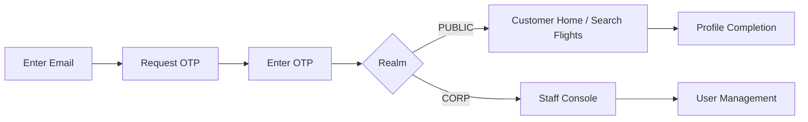

# Flight Booking Platform: Login, Registration, and User Management Plan

## 1. Scope and User Types
This plan defines authentication and user management for two identity domains:

- Corporate users (airline staff): operations, pricing, inventory, support, admin.
- Public users (customers): search and book flights, manage trips, profile and payments.

Primary login method is Email OTP. Mobile OTP is designed as a drop-in future factor.

## 2. Identity Model

### 2.1 Identity Domains
- Workforce realm (`CORP`): strict RBAC, SSO-ready, audit-heavy.
- Customer realm (`PUBLIC`): frictionless onboarding, OTP-first, optional MFA for high-risk actions.

### 2.2 Core Entities
- `User`: global identity record, unique email (normalized), status.
- `Credential`: OTP channel records (email now, phone future).
- `Role`: coarse permissions (`CORP_ADMIN`, `OPS_AGENT`, `SUPPORT_AGENT`, `CUSTOMER`).
- `Permission`: fine-grained actions (`inventory.write`, `booking.refund`, `user.disable`).
- `Session`: refresh token family + device metadata.
- `AuditEvent`: immutable auth and admin actions.

## 3. Authentication and Registration Plan

### 3.1 Email OTP Login (Current)
1. User submits email.
2. System creates short-lived OTP challenge (5-10 min) and sends email.
3. User submits OTP.
4. On success, issue:
   - Access token (JWT, 10-15 min)
   - Refresh token (opaque, rotating, 7-30 days)
5. Persist session and audit event.

### 3.2 Registration
- Public users:
  - Minimal sign-up: email + OTP verification + profile bootstrap.
  - Progressive profile completion after first login.
- Corporate users:
  - Admin-provisioned or HR feed (SCIM batch later).
  - First-login OTP + mandatory passwordless policy + optional WebAuthn for admin roles.

### 3.3 Future Mobile OTP Integration
- Add `phone_number` as verified contact method.
- Reuse challenge engine with channel strategy (`EMAIL` | `SMS` | `WHATSAPP` optional).
- Policy examples:
  - Public: email OTP OR mobile OTP.
  - Corporate privileged roles: email OTP + WebAuthn or mobile OTP fallback.

## 4. Security Best Practices
- Use short OTP expiry (<= 10 min), single-use OTP, attempt limits, and lockout cooldown.
- Hash OTP server-side (never store OTP plaintext).
- Rate limit by email, IP, device fingerprint, and ASN reputation.
- Add bot protection on OTP request endpoint (captcha or behavioral).
- Use rotating refresh tokens with reuse-detection and full family revocation.
- Bind sessions to user-agent/device risk signals.
- Enforce SPF, DKIM, DMARC for email deliverability and anti-spoofing.
- Use signed audit logs and immutable retention for corporate realm.
- Separate secrets per environment; use vault-based secret delivery.
- Add anomaly rules (impossible travel, unusual ASN, OTP spray).

## 5. Open Source Options (Recommended Stack)

### Option A (Best enterprise fit): Keycloak
- Use for IAM, realms, RBAC, identity brokering, admin APIs.
- Extend with custom OTP authenticator flow for email OTP.
- Pros: mature, enterprise features, strong admin tooling.
- Cons: heavier operations footprint.

### Option B (Cloud-native modular): Ory Kratos + Ory Hydra + Keto
- Kratos for identity flows, Hydra for OAuth2/OIDC, Keto for authorization.
- Pros: microservice-first, composable, API-centric.
- Cons: steeper integration complexity.

### Option C (Modern OSS IAM): ZITADEL
- Passwordless-friendly, multi-tenant capable, good developer UX.
- Pros: modern architecture, strong auth features.
- Cons: migration ecosystem may be smaller than Keycloak.

### Supporting OSS Components
- API Gateway: Kong or Traefik.
- Service mesh/security: Istio or Linkerd.
- OTP email provider abstraction: Postal/Mailpit (dev), SES/SendGrid (prod adapters).
- Policy engine: Open Policy Agent (OPA).
- Observability: OpenTelemetry + Prometheus + Grafana + Loki.

## 6. API List (Auth + User Management)
Base path: `/api/v1`

### 6.1 Authentication APIs
- `POST /auth/otp/request`
  - Input: `{ email, realm, purpose }`
  - Output: `{ challenge_id, expires_in, resend_after }`
- `POST /auth/otp/verify`
  - Input: `{ challenge_id, otp }`
  - Output: `{ access_token, refresh_token, user, expires_in }`
- `POST /auth/token/refresh`
  - Input: `{ refresh_token }`
  - Output: `{ access_token, refresh_token, expires_in }`
- `POST /auth/logout`
  - Input: `{ refresh_token }`
  - Output: `204`
- `POST /auth/logout-all`
  - Input: `{ user_id }` (self/admin policy)
  - Output: `204`

### 6.2 Registration and Profile APIs
- `POST /public/register`
  - Input: `{ email, locale, marketing_opt_in }`
  - Output: OTP challenge payload
- `GET /users/me`
- `PATCH /users/me`
  - Input: `{ first_name, last_name, phone, preferences }`
- `POST /users/me/email/change/request`
- `POST /users/me/email/change/confirm`

### 6.3 Corporate User Management APIs
- `GET /corp/users?status=&role=&q=`
- `POST /corp/users`
  - Input: `{ email, role_ids, department, manager_id }`
- `GET /corp/users/{id}`
- `PATCH /corp/users/{id}`
- `POST /corp/users/{id}/disable`
- `POST /corp/users/{id}/enable`
- `POST /corp/users/{id}/roles`
- `DELETE /corp/users/{id}/roles/{roleId}`

### 6.4 Authorization and Audit APIs
- `GET /authz/roles`
- `GET /authz/permissions`
- `GET /audit/events?actor=&action=&from=&to=`
- `GET /sessions/me`
- `DELETE /sessions/me/{sessionId}`

### 6.5 Error Contract (All APIs)
```json
{
  "code": "OTP_INVALID",
  "message": "The OTP is invalid or expired.",
  "trace_id": "8f3a...",
  "details": {}
}
```

## 7. UI Implementation Plan with Wireframes

### 7.1 Screen Flow


### 7.2 Wireframe: Login (Email OTP)
```text
+------------------------------------------------+
| SkyFly                                          |
| Sign in                                         |
|------------------------------------------------|
| Email                                           |
| [______________________________]                |
| Realm: ( ) Customer   ( ) Airline Staff         |
| [ Send OTP ]                                    |
|------------------------------------------------|
| Need help? Contact support                      |
+------------------------------------------------+
```

### 7.3 Wireframe: OTP Verification
```text
+------------------------------------------------+
| Verify your email                               |
| OTP sent to: m***@domain.com                   |
| [ _ ] [ _ ] [ _ ] [ _ ] [ _ ] [ _ ]            |
| Expires in: 04:21                               |
| [ Verify ]   [ Resend OTP ]                     |
+------------------------------------------------+
```

### 7.4 Wireframe: Corporate User Management
```text
+--------------------------------------------------------------------------------+
| Staff Console > User Management                                                |
| Search [____________] Role [v] Status [v] [Filter] [Add User]                 |
|--------------------------------------------------------------------------------|
| Name          Email                  Role         Status     Last Login         |
| A. Kumar      a.kumar@airline.com    OPS_AGENT    Active     2026-02-24 09:50   |
| R. Das        r.das@airline.com      SUPPORT      Disabled   2026-02-18 12:11   |
|--------------------------------------------------------------------------------|
| [View] [Disable/Enable] [Reset Access] [Assign Role]                           |
+--------------------------------------------------------------------------------+
```

### 7.5 UI Technical Pattern (Frontend)
- Route groups:
  - Public app: `/`, `/login`, `/verify-otp`, `/trips`, `/profile`
  - Corporate app: `/corp/login`, `/corp/dashboard`, `/corp/users`, `/corp/audit`
- Session handling:
  - Keep access token in memory.
  - Keep refresh token in HttpOnly secure cookie.
  - Silent refresh before expiry; force re-auth on refresh reuse detection.
- Guarding:
  - Role-based route guards + backend enforcement (never frontend-only).
- UX:
  - OTP autofill support, resend cooldown timer, clear error codes.

## 8. Polyglot Microservices Plan

### 8.1 Recommended Service Split
- `identity-service` (Java/Kotlin or Go): auth flows, OTP orchestration, tokens.
- `user-profile-service` (Node.js/TypeScript): customer profile, preferences.
- `corp-admin-service` (Java Spring Boot): corporate user and role operations.
- `flight-search-service` (Go): low-latency query aggregation and caching.
- `pricing-service` (Python): dynamic pricing/rules engine.
- `inventory-service` (Java): seats, fare classes, availability.
- `booking-service` (Java): PNR lifecycle, booking state machine.
- `payment-service` (Go): payment orchestration, idempotency, webhooks.
- `notification-service` (Node.js): email/SMS/push templates and delivery.
- `audit-compliance-service` (Rust or Java): immutable logs and compliance exports.

### 8.2 Data Stores by Workload
- PostgreSQL: identity, booking, corporate admin.
- Redis: OTP challenge cache, session hints, throttling counters.
- Elasticsearch/OpenSearch: audit/event search.
- Kafka or RabbitMQ: domain events (`user.created`, `otp.verified`, `booking.confirmed`).

### 8.3 Platform Capabilities
- API gateway + centralized authn/z.
- Service-to-service mTLS.
- Outbox pattern + idempotent consumers.
- Contract testing (Pact) and schema registry for events.
- SLOs per critical service (auth, booking, payment).

## 9. Phased Rollout
- Phase 1: Email OTP auth, customer registration, basic corporate provisioning.
- Phase 2: Advanced RBAC/ABAC, audit dashboards, session/device management.
- Phase 3: Mobile OTP, WebAuthn for privileged staff, SCIM/HR sync.
- Phase 4: Risk-based adaptive auth and fraud signals.

## 10. Non-Functional Requirements
- Availability targets:
  - Auth APIs: 99.95%
  - Booking/payment APIs: 99.99%
- Security:
  - OWASP ASVS L2 baseline
  - PCI-DSS scope isolation for payment service
- Compliance:
  - GDPR/DPDP-ready consent and data lifecycle management

---
This README is a target-state blueprint. Implementation can start with Keycloak + existing Java services and progressively move to full polyglot decomposition.
